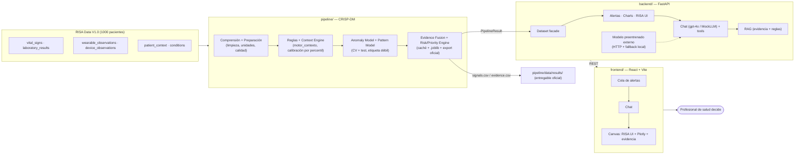

# RISA Signal

**HealthSignal LATAM — Anticiparse al riesgo** · Hackathon Internacional Perú 2026 · Talento TECH

Prototipo funcional que integra las fuentes heterogéneas de **RISA Data V1.0** (1000 pacientes sintéticos: signos vitales, laboratorio, wearables, dispositivos y contexto), detecta y prioriza señales de riesgo mediante un pipeline **CRISP-DM** reproducible, y las expone en un dashboard conversacional con evidencia trazable hasta el registro fuente.

**RISA Signal no diagnostica, no prescribe y no sustituye el criterio clínico.** Prioriza a quién revisar primero y explica por qué, con la evidencia que lo sustenta — apoyo a la decisión, tal como delimita el alcance oficial del reto.

---

## Tabla de contenidos

- [Propuesta](#propuesta)
- [Objetivos](#objetivos)
- [Arquitectura](#arquitectura)
- [Metodología (CRISP-DM)](#metodología-crisp-dm)
- [Stack tecnológico](#stack-tecnológico)
- [Instalación y ejecución](#instalación-y-ejecución)
- [Demo guiada](#demo-guiada)
- [Resultados](#resultados)
- [Entregable oficial](#entregable-oficial)
- [Limitaciones conocidas](#limitaciones-conocidas)
- [Declaración tecnológica](#declaración-tecnológica)
- [Documentación](#documentación)
- [Equipo](#equipo)

---

## Propuesta

RISA (Red Integrada de Salud Avanzada) observa a cada paciente desde fuentes que no comparten frecuencia, formato ni momento de disponibilidad: un monitor, un laboratorio, un wearable, un registro de contexto. Un valor aislado casi nunca alcanza para saber si algo merece atención — y un sistema de umbrales estáticos, sobre datos reales y ruidosos, termina o en silencio total o en una alarma por cada variable que se mueve.

RISA Signal transforma esa información dispersa en una cadena de razonamiento verificable:

```
datos heterogéneos → integración con procedencia → contexto y calidad → detección multivariable
→ prioridad → evidencia trazable → explicación → apoyo a la revisión humana
```

El resultado no es un dashboard más de signos vitales: es una cola de casos ordenada por prioridad, donde cada alerta —incluida la que se descarta— muestra qué la originó y por qué.

## Objetivos

| # | Objetivo | Cómo se demuestra |
| --- | --- | --- |
| 1 | Integrar ≥2 fuentes heterogéneas de RISA conservando IDs y procedencia | `pipeline/comprension_datos.py` + `preparacion_datos.py` sobre los 1000 pacientes reales |
| 2 | Detectar patrones combinando fuentes y evolución temporal, no umbrales de una sola variable | `pipeline/modelado.py` (reglas calibradas por percentil) + 6 candidatos de Anomaly Model + 4 de Pattern Model, comparados en `pipeline/deteccion_anomalias.py`/`modelado_patrones.py`, ver [Resultados](#resultados) |
| 3 | Priorizar y controlar falsas alertas sin ocultar lo descartado | 413/1000 pacientes descartados **con motivo visible** (`CONTEXTUAL`, `TRANSIENT`, `LOW_QUALITY`) |
| 4 | Explicar y trazar cada señal hasta el registro fuente | Tarjeta de evidencia (UI) + `pipeline/data/results/evidence.csv` con `source_file`/`record_id` por señal |
| 5 | Permitir exploración dinámica durante la evaluación | Chat con tools sobre el dataset real, dashboards RISA UI, gráficos Plotly bajo demanda |
| 6 | No sustituir el criterio clínico | Ninguna salida se presenta como diagnóstico; siempre score + prioridad + evidencia (RN-03) |

## Arquitectura

Tres componentes de primer nivel, con una sola dirección de dependencia (`pipeline → backend → frontend`; detalle de patrones en [`docs/guias/02-arquitectura-y-patrones.md`](docs/guias/02-arquitectura-y-patrones.md)):



- **`pipeline/`** es el único componente que toca los CSV crudos (`pipeline/data/raw/`, inmutable). Produce un `PipelineResult` con procedencia y calidad ya resueltas, y el entregable oficial `pipeline/data/results/signals.csv` + `evidence.csv`.
- **`backend/`** no procesa datos: sirve lo que el pipeline ya integró, vía REST, y orquesta el chat/RAG/RISA UI/modelo externo sobre eso.
- **`frontend/`** consume solo HTTP — cola de alertas, chat conversacional, dashboards compuestos (RISA UI Protocol) y gráficos interactivos (Plotly).

Ver también el boceto de visión completa (multi-institución, agentes de datos/modelado) en [`docs/arquitectura.md`](docs/arquitectura.md) y el porqué del recorte en [`ADR-0002`](docs/adr/0002-arquitectura-pipeline-agentico-crispdm.md).

## Metodología (CRISP-DM)

| Fase | Dónde | Qué hace realmente |
| --- | --- | --- |
| Comprensión del negocio | [`pipeline/comprension_negocio.md`](pipeline/comprension_negocio.md) (mapea [`docs/Negocio.md`](docs/Negocio.md) a código) | Preguntas de negocio + arquitectura (Anomaly/Pattern/Context/Fusion/Risk/Priority/Explanation) escritas antes de tocar datos |
| Comprensión de los datos | `pipeline/comprension_datos.py` | Carga las 7 fuentes oficiales desde `pipeline/data/raw/`, perfila cobertura y `quality_flag` |
| Preparación de los datos | `pipeline/preparacion_datos.py` | Dedupe/retransmisiones, normalización de unidad, recorte de implausibles — escribe `pipeline/data/clean/` |
| Modelado (reglas + contexto) | `pipeline/modelado.py` + `pipeline/motor_contexto.py` | Features por paciente → **umbrales calibrados por percentil poblacional** → motor de reglas que consulta al Context Engine (actividad + sueño) y genera la evidencia — escribe `pipeline/data/features/` |
| Evaluación (Anomaly + Pattern Model) | `pipeline/deteccion_anomalias.py` + `pipeline/modelado_patrones.py` + `pipeline/evaluacion.py` | Comparan, cada uno por su lado, varios candidatos con matriz de confusión + precisión/recall/F1/ROC-AUC en validación cruzada + test (etiqueta débil, RISA no entrega Gold Standard — [`ADR-0009`](docs/adr/0009-evaluacion-etiqueta-debil.md)); eligen y persisten el mejor de cada familia en `pipeline/data/model/` |
| Despliegue (Fusion + Risk + Priority + Explanation) | `pipeline/fusion_evidencia.py` + `pipeline/motor_riesgo.py` + `pipeline/motor_prioridad.py` + `pipeline/explicacion.py` + `pipeline/despliegue.py` | Combinan reglas + Anomaly Model + Pattern Model en `risk_score`/`priority_level`, redactan la explicación desde la evidencia, cachean para el backend y exportan `pipeline/data/results/` |

Detalle completo en [`pipeline/README.md`](pipeline/README.md), [`SPEC-008`](docs/spec/008-pipeline-crispdm.md) y [`SPEC-009`](docs/spec/009-evaluacion-y-entregable-oficial.md).

## Stack tecnológico

| Capa | Elección | Por qué (ADR) |
| --- | --- | --- |
| Datos / pipeline | Python, `pandas`, `numpy`, `scikit-learn` | [`ADR-0008`](docs/adr/0008-pipeline-crispdm-datos-reales.md) |
| Backend | FastAPI | [`ADR-0003`](docs/adr/0003-backend-fastapi-frontend-react.md) |
| Frontend | React + Vite + Plotly.js | [`ADR-0003`](docs/adr/0003-backend-fastapi-frontend-react.md) |
| LLM del chat | `gpt-4o` (o `MockLLM` sin API key) | [`ADR-0004`](docs/adr/0004-modelo-llm-gpt-4o.md) |
| Dashboards generados | RISA UI Protocol v1.0 (catálogo cerrado) | [`ADR-0005`](docs/adr/0005-risa-ui-protocol.md) |
| RAG de evidencia | TF-IDF u OpenAI embeddings | [`ADR-0006`](docs/adr/0006-rag-hibrido.md) |
| Modelo preentrenado | HTTP remoto + fallback local | [`ADR-0007`](docs/adr/0007-modelo-preentrenado-http.md) |
| Detección | Reglas calibradas por percentil (evidencia) + mejor Anomaly Model + mejor Pattern Model, cada familia comparada por separado | [`ADR-0002`](docs/adr/0002-arquitectura-pipeline-agentico-crispdm.md), [`ADR-0009`](docs/adr/0009-evaluacion-etiqueta-debil.md) |
| Modelos entrenables | `scikit-learn` (Z-score/MAD/IQR, `IsolationForest`, `LocalOutlierFactor`, `MLPRegressor`), `xgboost`, `lightgbm` | [`ADR-0009`](docs/adr/0009-evaluacion-etiqueta-debil.md) |

## Instalación y ejecución

Requiere Python 3.10+ y Node 18+. El pipeline procesa ~250 MB de CSV la primera vez, entrena y compara los candidatos del Anomaly Model y del Pattern Model (~2-4 min); a partir de ahí usa caché (`pipeline/data/cache/dataset.pkl`, ~5 s). **Requiere `pipeline/data/raw/` presente** (RISA Data V1.0 oficial) — no hay dataset sintético de reemplazo; si no está, el backend no arranca (`RisaDataNotFoundError`, mensaje explícito en consola).

### 1. Backend (incluye el pipeline)

```bash
cd backend
python -m venv .venv
.venv\Scripts\activate
pip install -r requirements.txt
copy .env.example .env
uvicorn app.main:app --reload --reload-dir app --port 8000
```

Sin `OPENAI_API_KEY` el chat usa **MockLLM** + las mismas tools (dataset, alertas, RISA UI, gráficos, RAG) sobre los datos reales. Con key, el modelo es **`gpt-4o`**. `PRETRAINED_MODEL_URL` conecta un modelo preentrenado externo por HTTP; si no está, hay fallback local (`local-fallback-0.1`).

### 2. Pipeline por separado (opcional — regenerar el entregable oficial)

```bash
python -m pipeline.run_pipeline --export-submission
python "docs/Participantes Salud/02_KIT_ENTREGA/validate_submission.py" pipeline/data/results/ --risa pipeline/data/raw
```

### 3. Frontend

```bash
cd frontend
npm install
npm run dev
```

Abrir `http://localhost:5173` — el API por defecto es `http://localhost:8000`.

## Demo guiada

1. **Cola de alertas** — filtrar por `CRITICO`/`ALTO`: cada caso muestra patrón (`PROGRESSIVE_MULTISOURCE`, `EARLY_SIGNAL`...) y score.
2. **Chat** → «¿A quién debo revisar primero y por qué?» — el LLM llama `list_alerts` y cita evidencia RAG, nunca inventa un valor.
3. «Armá un dashboard del turno» → canvas RISA UI con KPIs, cola y evidencia del caso top, hidratado con datos reales.
4. Abrir una alerta `DESCARTADO` → ver por qué (contexto de actividad, outlier transitorio o calidad de señal baja) — lo descartado no se oculta (RN-02).
5. «¿Qué dice el modelo preentrenado del caso más prioritario?» → respuesta remota si `PRETRAINED_MODEL_URL` está configurado, o `local_fallback` etiquetado como tal.

## Resultados

Corrida de referencia sobre **RISA Data V1.0 completo (1000 pacientes)**, ventana de análisis de 120 h por paciente:

| Nivel | Pacientes | Significado |
| --- | --- | --- |
| `CRITICO` | 1 | Evolución conjunta FC + marcador de laboratorio, ambos fuera del percentil 90 poblacional |
| `ALTO` | 5 | `PROGRESSIVE_MULTISOURCE` o `EARLY_SIGNAL` con menor score |
| `MEDIO` | 27 | Señal parcial (p. ej. solo falta laboratorio) |
| `BAJO` | 554 | Dentro de lo esperado para la población |
| `DESCARTADO` | 413 | Explicado por contexto de actividad, outlier transitorio o calidad de señal baja — **con motivo visible, no oculto** |

**Anomaly Model + Pattern Model** (etiqueta débil — RISA Data V1.0 no incluye Gold Standard, ver [`ADR-0009`](docs/adr/0009-evaluacion-etiqueta-debil.md)). Split por paciente 85 % (`dev`, validación cruzada de 5 folds, es la base de la selección) / 15 % (`test`, nunca usado para elegir el modelo — solo para el chequeo final):

**Anomaly Model** (¿es esta observación inusual respecto a la población? — no supervisado):

| Candidato | F1 `cv` | F1 `test` | Matriz de confusión test (TP/FP/FN/TN) |
| --- | --- | --- | --- |
| Z-score | 0.21 | 0.38 | 4 / 13 / 0 / 133 |
| **MAD — elegido (mejor F1 en `cv`)** | **0.23** | 0.11 | 1 / 13 / 3 / 133 |
| IQR | 0.15 | 0.21 | 2 / 13 / 2 / 133 |
| `IsolationForest` | 0.20 | 0.35 | 3 / 10 / 1 / 136 |
| `LocalOutlierFactor` | 0.22 | 0.30 | 3 / 13 / 1 / 133 |
| Autoencoder (`MLPRegressor`) | 0.20 | 0.42 | 4 / 11 / 0 / 135 |

**Pattern Model** (¿hay un patrón que justifique una señal? — supervisado, entrenado contra la etiqueta débil):

| Candidato | F1 `cv` | F1 `test` | Matriz de confusión test (TP/FP/FN/TN) |
| --- | --- | --- | --- |
| Regresión logística (baseline) | 0.29 | 0.27 | 2 / 9 / 2 / 137 |
| Random Forest | 0.07 | 0.00 | 0 / 0 / 4 / 146 |
| **XGBoost — elegido** | **0.51** | **0.67** | 2 / 0 / 2 / 146 |
| LightGBM | 0.48 | 0.40 | 1 / 0 / 3 / 146 |

**Criterio de selección (ambas familias):** mayor F1 promedio en validación cruzada sobre `dev` (desempate por precisión) — nunca el test, que queda intocado hasta el chequeo final. Las reglas dinámicas no compiten en ninguna tabla: no son un estimador que se pueda ajustar y guardar, son el motor que genera la evidencia de cada alerta. Ambos ganadores (`mad`, `xgboost`) se persisten en `pipeline/data/model/*.joblib` y se aplican a los 1000 pacientes para producir `anomaly_score`/`pattern_score` en cada alerta servida por la API.

Interpretación honesta: `XGBoost` generaliza bien (precisión perfecta en test, sin falsos positivos) — es un resultado real, no maquillado. El Anomaly Model es la historia más interesante: `MAD` gana en validación cruzada pero rinde peor en test que el autoencoder o `Z-score` — exactamente el mismo fenómeno de "el ganador en `cv` no siempre es el más robusto" que ya se vio con `Random Forest` en el Pattern Model, dejado a la vista en vez de ocultado. Con ~1000 pacientes y una etiqueta positiva minoritaria (~3 % del total), estas cifras miden **consistencia entre enfoques**, no precisión clínica real. Tabla completa (con ROC-AUC) en `GET /api/pipeline/report` y en [`pipeline/notebooks/01_eda_y_comparacion_modelos.ipynb`](pipeline/notebooks/01_eda_y_comparacion_modelos.ipynb).

## Entregable oficial

```bash
python -m pipeline.run_pipeline --export-submission
```

Genera `pipeline/data/results/signals.csv` y `pipeline/data/results/evidence.csv` en el formato exacto del reto. Verificado con el validador oficial:

```
VALID SUBMISSION FORMAT — 0 warning(s)
```

## Limitaciones conocidas

- **Sin Gold Standard**: toda métrica cuantitativa es contra una etiqueta débil derivada del propio motor de reglas ([`ADR-0009`](docs/adr/0009-evaluacion-etiqueta-debil.md)) — mide consistencia entre enfoques, no precisión clínica real.
- **Tamaño de muestra positiva pequeño**: ~3 % de los 1000 pacientes cae en la etiqueta débil positiva — los modelos supervisados entrenan sobre unas pocas decenas de ejemplos. Es la razón por la que la selección usa validación cruzada de 5 folds en vez de un único split (`Random Forest` la expone: gana con un solo split, se desploma con CV real), y por la que **no se implementaron GRU/LSTM/Transformer** para el Pattern Model — no hay datos suficientes para entrenar un modelo secuencial profundo sin que aprenda ruido (justificación completa en [`pipeline/comprension_negocio.md`](pipeline/comprension_negocio.md)).
- **Calibración y entrenamiento dependientes de la muestra**: tanto los umbrales de las reglas como los 5 modelos se recalculan sobre la población cargada en cada corrida; una corrida parcial (`--patients N`) da resultados distintos a la corrida completa. La entrega oficial siempre corre sin `--patients`.
- **Sin dataset de reemplazo**: si RISA Data V1.0 no está presente, el sistema no arranca (por diseño, ver [`ADR-0008`](docs/adr/0008-pipeline-crispdm-datos-reales.md)) — no hay demo posible sin el dataset oficial.
- **Sin autenticación ni multi-institución real**: alcance deliberado de 12 h, ver [`docs/guias/04-seguridad-y-datos.md`](docs/guias/04-seguridad-y-datos.md) y [`ADR-0002`](docs/adr/0002-arquitectura-pipeline-agentico-crispdm.md).
- **`LAB_A`–`LAB_D`** son marcadores sintéticos sin significado clínico real (lo declara la guía oficial); las reglas y los modelos los tratan como evidencia multifuente genérica, no como analitos con nombre.

## Declaración tecnológica

| Componente | Origen | Uso |
| --- | --- | --- |
| `gpt-4o` (OpenAI) | API externa, opcional | Redacción conversacional del chat sobre datos ya recuperados por tools; nunca escribe sobre el dataset ni sobre `pipeline/data/results/` |
| `scikit-learn` (Z-score/MAD/IQR, `IsolationForest`, `LocalOutlierFactor`, `MLPRegressor`, `LogisticRegression`, `RandomForestClassifier`), `xgboost`, `lightgbm` | Librerías open source | Anomaly Model (6 candidatos) y Pattern Model (4 candidatos) entrenados y comparados con matriz de confusión; el ganador de cada familia se persiste y se usa en producción (`anomaly_score`/`pattern_score`) |
| RISA Data V1.0 | Dataset oficial del reto (Talento TECH) | Única fuente de datos de pacientes; 100 % sintética; sin dataset de reemplazo |
| Modelo preentrenado externo | Proyecto de terceros vía HTTP (`PRETRAINED_MODEL_URL`), opcional | Score adicional consultado bajo demanda, con fallback local declarado (`local-fallback-0.1`) — distinto del modelo entrenado en `pipeline/`, no sustituye el dataset |

Sin datasets externos adicionales ni fine-tuning de ningún modelo de lenguaje. Los modelos de `scikit-learn` sí se entrenan (no son preentrenados) — sobre features derivadas de RISA Data V1.0 y una etiqueta débil, nunca sobre datos inventados.

## Documentación

- Definición del proyecto: [`docs/definicion.md`](docs/definicion.md)
- Specs (qué hace el sistema): [`docs/spec/README.md`](docs/spec/README.md)
- ADRs (por qué se decidió así): [`docs/adr/README.md`](docs/adr/README.md)
- Guías (cómo se construye): [`docs/guias/README.md`](docs/guias/README.md) — API, arquitectura y patrones, frontend, seguridad
- Pipeline CRISP-DM: [`pipeline/README.md`](pipeline/README.md) · comprensión de negocio: [`pipeline/comprension_negocio.md`](pipeline/comprension_negocio.md) · EDA y comparación de modelos: [`pipeline/notebooks/01_eda_y_comparacion_modelos.ipynb`](pipeline/notebooks/01_eda_y_comparacion_modelos.ipynb)

## Equipo

| Integrante | Rol |
| --- | --- |
| **Jefferson Flores Montenegro** | Full Stack Developer — backend (FastAPI), frontend (React) e integración end-to-end del pipeline con la API |
| **Cristhian Maylle** | Data Scientist — metodología CRISP-DM, detección de señales, calibración del modelo y evaluación |
| **Nicole Gonzales** | Líder de Producto y Experiencia — estrategia de UX, narrativa del producto y pitch ante el jurado |
