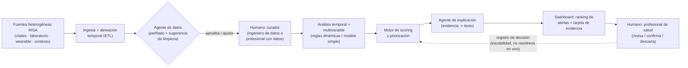

# ADR-0002 — Pipeline agéntico tipo CRISP-DM con human-in-the-loop, no plataforma multi-agente

- Estado: `aceptada`
- Fecha: 2026-08-26
- Decisores: equipo

## Contexto

El boceto original de arquitectura (ver `docs/` — imagen del equipo) plantea: ingesta de datos heterogéneos → agente de datos (limpieza + estadística multivariable) → etapa de modelado con un agente que decide qué modelos entrenar y elige el mejor → plataforma/app de gestión de salud con modelo adaptado por institución, cruce de información entre instituciones, identificación/validación/mejora continua → agente conversacional final que responde con dashboards y explica cada alerta con trazabilidad.

Es una traducción razonable del flujo conceptual que pide el reto (`Fuentes heterogéneas → integración → contextualización → análisis temporal/multivariable → identificación de patrones → priorización → explicabilidad → apoyo a decisión`, ver `DESAFÍO Salud.pdf`), y respeta el alcance clínico (apoyo, no diagnóstico) y el enfoque human-in-the-loop.

El problema es de tamaño, no de dirección: son al menos cinco componentes con lógica propia (agente de datos, agente de modelado, capa de gestión multi-institución, capa de identificación/validación/mejora, agente conversacional), y el equipo tiene **12 horas** y **3 personas**. Construir los cinco como servicios/agentes separados compite directamente con RN-04 (*"ante conflicto entre tiempo y sofisticación, gana un flujo P0 completo"*) y con la regla de evaluación técnica del reto: *"la evaluación se realizará sobre las capacidades efectivamente implementadas y demostradas [...] las funcionalidades descritas como trabajo futuro no serán consideradas equivalentes a funcionalidades operativas"*.

La rúbrica tampoco premia número de agentes: 70 pts van a arquitectura/funcionamiento end-to-end/innovación/impacto/pitch, y los 30 pts específicos de HealthSignal son integración+temporalidad, identificación de señales, priorización, gestión de falsas alertas y explicabilidad — todo alcanzable con un pipeline modular bien ejecutado.

## Decisión

Construir **un solo pipeline orquestado** (no una malla de agentes autónomos independientes) con **dos puntos concretos de asistencia por IA/agente** y **dos checkpoints humanos explícitos**, siguiendo las etapas de CRISP-DM pero comprimidas a lo demostrable en 12 h:

**Los dos agentes que sí se construyen:**
1. **Agente de datos (perfilado):** dado el dataset ingerido, sugiere qué hacer con faltantes/outliers/duplicados/desalineación y por qué. El curador humano aprueba o ajusta antes de que el pipeline siga (RN-01, RF-02). No decide solo ni ejecuta sin visto bueno — evita el riesgo de "caja negra" en la parte donde el reto exige justificar decisiones de calidad de datos.
2. **Agente de explicación:** toma el bundle de evidencia (variables, ventana, patrón detectado, score) del motor de scoring y redacta la explicación en lenguaje natural para la tarjeta de alerta. El texto generado se muestra siempre separado visualmente de la evidencia extraída de los datos (RN-06, exigido también por el contexto oficial de RISA sección 11).

**Lo que NO se construye como agente autónomo** (y por qué, mapeado 1:1 al boceto original):

| Pieza del boceto original | Por qué no se construye en 12 h | Dónde queda |
| --- | --- | --- |
| Agente que decide qué modelos entrenar y elige el mejor | Añade orquestación (búsqueda de hiperparámetros, comparación automática) sin sumar puntos de rúbrica frente a comparar 1–2 enfoques a mano y justificar cuál queda | Se compara manualmente regla dinámica vs. 1 modelo simple (p. ej. z-score/rolling vs. Isolation Forest); ver sección "Resultados medibles" del reto |
| Modelo adaptado por institución + cruce de información entre instituciones | Es interoperabilidad multi-tenant real: requiere gestión de identidad/permisos por institución que no es demostrable en 12 h y no es el criterio que puntúa (los 30 pts específicos son sobre un caso, no sobre una red) | Roadmap: se explica en el pitch como paso de "impacto y escalabilidad" (10 pts), no se implementa |
| Agente conversacional que responde con dashboards según la consulta libre de la persona | Requiere NL-to-query robusto sobre datos heterogéneos; alto riesgo de romper la demo en vivo (RN-04) | El dashboard es fijo pero completo (ranking + drill-down + evidencia); si sobra tiempo, un buscador simple sobre el mismo store de evidencia, no un agente conversacional general |
| Identificación, validación y mejora continua del modelo | Es un loop de MLOps; el reto pide reproducibilidad y evidencia de un flujo, no reentrenamiento en producción | RF-09 (marcar alerta como revisada/confirmada/descartada) deja el registro que *conceptualmente* alimentaría ese loop, sin implementarlo |

## Alternativas consideradas

| Opción | Por qué no (o por qué sí) |
| --- | --- |
| Plataforma multi-agente completa (boceto original tal cual, 5 agentes + multi-institución + chat NL) | Descartada: no cabe en 12 h con 3 personas; el riesgo de no tener ningún flujo P0 terminado es alto (R-08); funcionalidad no demostrada no puntúa |
| Pipeline 100 % determinista, sin IA/agentes en ningún punto | Descartada: pierde los puntos de innovación (15 pts) y no aprovecha donde el human-in-the-loop y la explicación en lenguaje natural sí agregan valor real y bajo riesgo |
| **Pipeline único orquestado con 2 agentes puntuales (perfilado + explicación) y 2 checkpoints humanos** | Elegida: cubre los 30 pts específicos de HealthSignal con una sola pasada de código, dos oportunidades reales de mostrar "IA con criterio" sin apostar la demo a un componente frágil, y dos puntos de human-in-the-loop coherentes con el boceto original (ingeniero/profesional con datos, y profesional de salud) |

## Consecuencias

- Positivas: un solo flujo para integrar y probar; cada componente es reemplazable (regla → modelo → modelo mejor) sin tocar el resto; el pitch puede mostrar el boceto completo como visión sin que el jurado lo confunda con lo implementado (se presentan por separado: "esto corre hoy" vs. "esto es a dónde escala").
- Negativas / deuda: no hay verdadera multi-institución ni selección automática de modelo; si un jurado pregunta por eso, la respuesta es "es la siguiente iteración, aquí está el porqué del corte" (defendible con esta ADR).
- Impacto en RF / RNF / RN: fija RF-01…RF-09 y RN-06/RN-07 de `definicion.md`; sostiene RNF-04 (explicabilidad) y RNF-07 (robustez) al no depender de un componente conversacional fràgil en vivo.

## Reversibilidad

Media: agregar un tercer agente (p. ej. selección automática de modelo) después del hackathon es incremental sobre este pipeline, no requiere reescritura. Quitar el agente de explicación y volver a texto fijo por reglas es trivial (fallback ya contemplado en RF-08).
