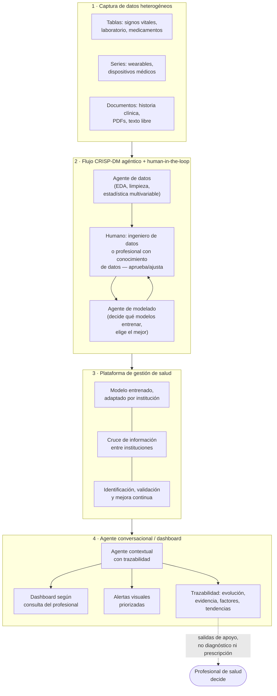
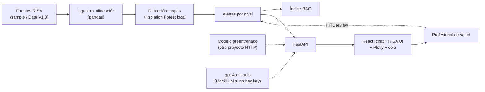

# Arquitectura de la idea — RISA Signal

Este documento explica la idea original tal como la planteó el equipo (la del boceto a mano), con la arquitectura completa, el stack propuesto y el árbol de carpetas del proyecto. No repite los recortes de alcance — esos ya están fijados en [`ADR-0002`](adr/0002-arquitectura-pipeline-agentico-crispdm.md) — pero sí distingue, en cada sección, qué parte se construye en el hackathon y qué parte es la visión completa del producto.

---

## 1. La idea, en palabras simples

Todo arranca de un problema concreto: en una red de salud como RISA, los datos de un mismo paciente están repartidos — signos vitales de un monitor, un resultado de laboratorio, una lectura de un wearable, una nota de la historia clínica — y cada fuente tiene su propio formato, su propia frecuencia y su propia forma de fallar (huecos, duplicados, ruido). Nadie puede revisar eso a mano para cientos de pacientes, y un sistema de alarmas por umbral simple termina generando ruido en vez de ayuda.

La idea tiene tres partes que se conectan en cadena:

**Parte 1 — Captura de datos heterogéneos.** Antes de analizar nada, hay que poder recibir información de distinta naturaleza: tablas (CSV, registros de laboratorio, signos vitales), series de dispositivos/wearables, y — si el escenario lo permite — documentos o texto (historias clínicas, PDFs). No todo llega limpio ni completo, y eso es parte del problema a resolver, no un caso de borde.

**Parte 2 — Un flujo tipo CRISP-DM, pero automatizado con agentes y con humano en el loop.** En vez de que una sola persona haga a mano cada etapa clásica de un proyecto de datos (entender los datos, limpiarlos, analizarlos, modelar, evaluar), cada etapa tiene un agente que hace el trabajo pesado y le presenta a una persona una decisión ya masticada para aprobar o ajustar. Ese "alguien" no tiene que ser necesariamente un ingeniero: puede ser un profesional de salud con conocimiento de datos, porque el agente traduce lo técnico a algo que se puede aprobar con criterio clínico, no solo estadístico. Esto incluye la etapa de modelado: un agente ayuda a decidir qué modelos probar y cuál conviene según cómo se comportan los datos.

**Parte 3 — La plataforma de gestión de salud.** Una vez que hay un modelo que funciona, este se integra en una aplicación que cada institución puede adaptar a su propia población, que permite cruzar información entre instituciones cuando corresponde (con su propia identificación y validación), y que se retroalimenta con el tiempo para mejorar. Sobre esa plataforma vive el componente que ve el profesional de salud: un agente conversacional que responde con dashboards y gráficos según lo que la persona pregunta, muestra las alertas de forma visual, y explica — con trazabilidad — por qué cada alerta existe: qué datos la originaron, cómo evolucionaron, y qué la hace relevante.

El hilo conductor de las tres partes es el mismo que pide el reto: **datos fragmentados → integración con contexto → señal priorizada → evidencia explicable → apoyo a una decisión humana**, nunca un diagnóstico automático.

---

## 2. Qué se construye ahora y qué es visión completa

| Parte de la idea | En el hackathon (12 h) | Visión completa (roadmap / pitch) |
| --- | --- | --- |
| Captura heterogénea | 2–3 fuentes tabulares/series de RISA (vitales + laboratorio [+ wearable]) | + documentos/historia clínica en texto libre, + imágenes |
| Agente de datos (limpieza/EDA) | 1 agente de perfilado que sugiere tratamiento de calidad; lo aprueba un curador humano | Selección y comparación automática de múltiples estrategias de limpieza |
| Agente de modelado | Se comparan 1–2 enfoques a mano (regla dinámica vs. 1 modelo simple); no hay agente que "decide y entrena solo" | Agente que prueba varios modelos, los compara y elige, con reentrenamiento periódico |
| Plataforma institucional | No se construye; el prototipo corre para una institución/dataset único | Modelo adaptado por institución, cruce de información entre instituciones, identificación/validación de pacientes entre redes |
| Agente conversacional + dashboard | Chat anclado a tools (dataset, alertas, RISA UI, Plotly, RAG, modelo HTTP) + cola de alertas | Chat de propósito general y multi-institución |

El detalle de por qué se corta cada pieza (y qué tan reversible es el corte) está en `ADR-0002`. Este documento se queda con la idea completa; el ADR se queda con la decisión de alcance.

---

## 3. Arquitectura — visión completa

Así se ve la idea original de punta a punta, con las tres partes de la sección 1 como macro-bloques:



---

## 4. Arquitectura — lo que se construye en el hackathon

Es el mismo flujo, comprimido a lo que un equipo de 3 personas puede tener funcionando de punta a punta en 12 horas (mismo diagrama que fija `ADR-0002`, aquí con la capa técnica anotada):



El LLM no toca el scoring: llama tools. RISA UI y Plotly se hidratan en el servidor. Ver `ADR-0003`…`0007`.

---

## 5. Stack propuesto

Pensado para 12 h, sin infraestructura que montar, y con cada pieza reemplazable sin tocar el resto del pipeline. Se confirma en detalle en `ADR-0003` cuando se conozca el esquema exacto de `HealthSignal LATAM - Data V1.0`.

| Capa | Elección propuesta | Por qué |
| --- | --- | --- |
| Lenguaje | Python 3.11+ | Todo el ecosistema de datos/ML relevante vive ahí; el equipo no pierde tiempo cambiando de stack a mitad de camino |
| Ingesta y validación | `pandas` + `pydantic` | `pandas` para leer CSV/parquet heterogéneo; `pydantic` para declarar el esquema esperado de cada fuente y fallar rápido si algo no calza (RF-01/RF-08) |
| Almacenamiento de trabajo | `DuckDB` o SQLite (archivo local) | Cero infraestructura que levantar; consultas SQL rápidas sobre los datos ya alineados sin montar un motor aparte |
| Alineación temporal / features | `pandas` + `numpy` | Ventanas móviles, resampleo, combinación de variables — suficiente para RF-02/RF-03 sin librerías pesadas |
| Detección de señales | Reglas dinámicas en `pandas` + `scikit-learn` (p. ej. `IsolationForest`) como segundo enfoque comparado a mano | Cubre el "no es un umbral estático" del reto sin apostar todo a que un solo modelo entrene bien en el tiempo disponible |
| Agente de datos / agente de explicación | Llamada directa a una API de LLM (Claude o equivalente, intercambiable) con salida estructurada (`pydantic`/`instructor`) | Sin framework de agentes (LangChain, CrewAI, etc.): dos llamadas bien definidas con prompt + esquema de salida son más rápidas de depurar en 12 h que una orquestación genérica |
| Orquestación del pipeline | Un único script/entrypoint (`scripts/run_pipeline.py`) | El pipeline es lineal (ver diagrama de la sección 4); no hace falta cola de mensajes ni workers para el prototipo |
| Dashboard / chat | React + Vite + Plotly | Chat, canvas RISA UI y gráficos interactivos (`ADR-0003`) |
| Visualización | Plotly.js | Series temporales interactivas hidratadas por el backend |
| Backend | FastAPI | Dataset, alertas, RAG, tools del LLM, adaptador HTTP del modelo |
| Empaquetado y arranque | `requirements.txt` (o `pyproject.toml`) + `Makefile`/`run.sh` con un solo comando | Cumple RNF-05 ("alguien del equipo levanta el prototipo con un comando documentado") |
| Configuración/secretos | `.env` + `.env.example`, fuera de git | Cumple RNF-06/RNF-09; la clave del LLM y cualquier ruta a datos "oficiales" nunca se commitean |

---

## 6. Árbol de carpetas propuesto

Esta es la estructura real del repositorio, alineada con el stack de la sección 5 y con el pipeline CRISP-DM añadido en `ADR-0008`:

```
Hackathon-Internacional-IA/
├── README.md
├── docs/                            # definición, specs, ADR, guías, material oficial del reto (menos el dataset)
├── pipeline/                        # CRISP-DM sobre RISA Data V1.0 (componente propio, sin FastAPI ni React)
│   ├── data/
│   │   ├── raw/                     # RISA Data V1.0 oficial — inmutable
│   │   ├── clean/                   # vitales/labs limpios y normalizados (Parquet, regenerable)
│   │   ├── features/                # vector de features por paciente (Parquet, regenerable)
│   │   ├── model/                   # modelos ganadores persistidos (.joblib) + metadata — versionado
│   │   ├── results/                 # signals.csv + evidence.csv, el entregable oficial
│   │   └── cache/                   # PipelineResult serializado — regenerable, no versionado
│   ├── comprension_negocio.md       # fase 1 — preguntas de negocio (mapea docs/Negocio.md a código)
│   ├── comprension_datos.py         # fase 2 — carga cruda + perfilado
│   ├── preparacion_datos.py         # fase 3 — limpieza, unidades, calidad
│   ├── modelado.py                  # fase 4 — features + motor de reglas calibradas
│   ├── motor_contexto.py            # Context Engine — actividad (wearable) + sueño (patient_context)
│   ├── deteccion_anomalias.py       # Anomaly Model — estadística + ML + DL ligero, comparados
│   ├── modelado_patrones.py         # Pattern Model — baseline + RF/XGBoost/LightGBM, comparados
│   ├── fusion_evidencia.py          # Evidence Fusion — PRIMARY/SUPPORTING/CONTEXT/QUALITY
│   ├── motor_riesgo.py              # Risk Engine — risk_score [0,1]
│   ├── motor_prioridad.py           # Priority Engine — LOW/MEDIUM/HIGH/CRITICAL
│   ├── explicacion.py               # Explanation — redacta desde la evidencia fusionada
│   ├── evaluacion.py                # fase 5 — orquesta Anomaly/Pattern Model, persiste ambos ganadores
│   ├── despliegue.py                # fase 6 — orquesta todo, caché + export oficial
│   ├── notebooks/                   # EDA y comparación de modelos, ejecutado con outputs reales
│   └── run_pipeline.py              # CLI
├── backend/                         # FastAPI: sirve el pipeline, alertas, RAG, LLM, RISA UI
│   ├── app/
│   ├── requirements.txt
│   └── .env.example
└── frontend/                        # React + Vite: chat, canvas RISA UI, Plotly, alertas
    ├── src/
    └── package.json
```

Notas rápidas:
- El backend **no procesa datos**: `backend/app/data/loader.py` es un facade de una línea sobre `pipeline.despliegue` (`ADR-0008`).
- `pipeline/data/clean/`, `pipeline/data/features/` y `pipeline/data/cache/` quedan fuera de git (regenerables); `pipeline/data/raw/` (dataset oficial, 100 % sintético), `pipeline/data/model/` (modelos ganadores) y `pipeline/data/results/` (entregable oficial) sí se versionan.
- La llamada al LLM del chat (`backend/app/llm/orchestrator.py`) es, hoy, el único punto del código donde se invoca un modelo generativo — todo lo demás en `pipeline/` y en el resto de `backend/` es determinista y se puede probar sin red.
- No existe dataset sintético de reemplazo: si `pipeline/data/raw/` no está presente, `pipeline.despliegue.build_dataset()` lanza `RisaDataNotFoundError` y el backend no arranca — RF-08 ("degradar con mensaje claro") se cumple fallando visiblemente, no inventando datos.
